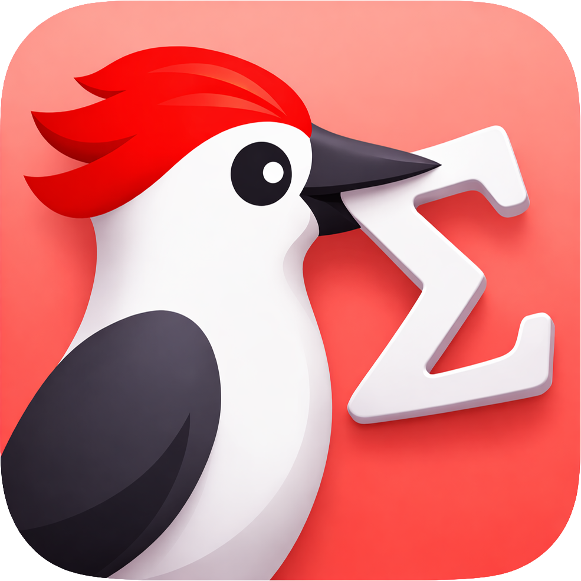
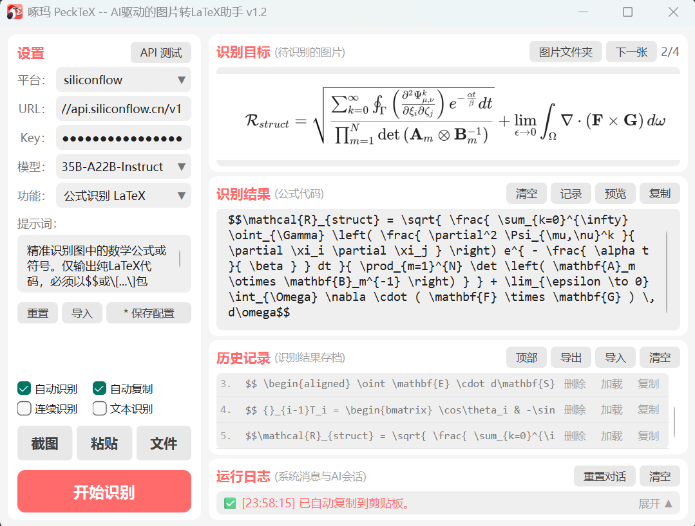
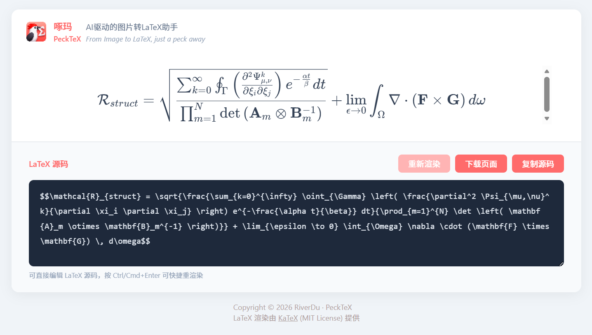

# PeckTeX

<div align="center">
   
   <h3>AI-Driven Image to LaTeX Desktop Tool</h3>

   [](https://github.com/River-Du/PeckTeX/releases)
   [](#)
   [](https://www.python.org/)
   [](https://wiki.qt.io/Qt_for_Python)
   [](https://opensource.org/licenses/MIT)


   **English** | [简体中文](./README.md)

</div>

## Table of Contents

- [Project Introduction](#project-introduction)
- [Features](#features)
- [Deployment and Startup](#deployment-and-startup)
- [Software Usage Guide](#software-usage-guide)
- [Configuration File Reference](#configuration-file-reference)
- [Project Structure](#project-structure)
- [Frequently Asked Questions (FAQ)](#frequently-asked-questions-faq)
- [License](#license)

## Project Introduction

**PeckTeX** is a lightweight desktop application built on **Python** and **PySide6**. By invoking multimodal Vision Language Model (VLM) APIs, it recognizes and converts image content such as mathematical formulas, chemical equations, handwritten derivations, tables, and charts into **LaTeX** and other markup formats.

Core processing workflow:

```text
Screenshot/Paste/File Import -> VLM API Recognition -> Streaming Output -> HTML/KaTeX Preview
```

**Main Window Screenshot:**

The GUI adopts a left-right split layout: the left side contains configuration and action controls, and the right side contains recognition results, status feedback, and AI chat.



**LaTeX Preview Screenshot:**

LaTeX previews are displayed in the local system browser. You can edit and re-render the output.



## Features

- **Convenient Image Input**: Supports screenshot capture, clipboard paste, local file import/drag-and-drop, and loading images from the user image folder.
- **Custom Recognition Functions**: Supports custom prompts for different tasks. Built-in templates include LaTeX formulas, MathML formulas, handwriting recognition, chemical equations, and general recognition.
- **Streaming Output and Local Preview**: Model responses stream into the editor in real time. Output can be edited and rendered via generated local HTML with KaTeX.
- **AI Conversational Correction**: Supports multi-turn AI chat for follow-up correction and refinement, with one-click append to result area.
- **Automation Capabilities**: Supports auto-recognize, auto-copy, batch/continuous recognition, and text recognition mode.
- **History Management**: Recognition results are stored in history with import/export support; each entry can be loaded, copied, or deleted.
- **API Configuration Management**: Supports multiple API providers, configuration import/reset/save, and platform-model management.

## Deployment and Startup

### Quick Start for Non-Developers

If you do not plan to modify the source code, it is recommended to use the Release package directly:

1. Open the Releases page: <https://github.com/River-Du/PeckTeX/releases>
2. Download the latest Windows package (typically `PeckTeX.zip`).
3. Extract it to a fixed directory (for example `D:\PeckTeX\`, not a temporary download folder).
4. Open the extracted folder and double-click `PeckTeX.exe`.
5. Create a desktop shortcut (Windows): right-click `PeckTeX.exe` -> `Send to` -> `Desktop (create shortcut)`.

Notes:

- If SmartScreen appears on first launch, click "More info" and then "Run anyway".
- The `_internal` folder under the app directory is required at runtime. Do not move, modify, or delete it.
- Configuration, user images, and history files are stored under `userdata`. Do not delete this folder.


### Environment Requirements

**Basic Runtime Environment**
- OS: Windows 10/11
- Python: >= 3.10

**Core Dependencies**
- PySide6 >= 6.5.3
- openai >= 1.30.1
- httpx >= 0.27.0

### Run from Source

```bash
git clone https://github.com/River-Du/PeckTeX.git
cd PeckTeX
pip install -r requirements.txt
python main.py
```

The repository root also provides `run.bat` for one-click startup in development:

```bash
run.bat
```

### Windows Packaging

The repository root provides `build.bat` for one-click packaging (PyInstaller onedir mode):

```bat
build.bat --release
```

- Uses debug build by default (console visible), and supports switching via parameters (`--debug` / `--release`).
- Automatically checks Python, PyInstaller, and required runtime packages.
- Automatically cleans previous `build/`, `dist/PeckTeX/`, and `PeckTeX.spec` outputs.
- Packaged executable path: `dist/PeckTeX/PeckTeX.exe`.

## Software Usage Guide

1. **Configure API and Function**:
   - On first use, in the left `Settings` panel, create or select an API platform (name is customizable), fill in platform `URL` and API `Key`, and select/input a platform `Model` (**must be a visual VLM model**).
   - Click `API Test` at the top-right of the panel. If `Operation Logs` shows "Service test successful", your API settings are valid.
   - In the `Function` selector, choose or create a function (e.g., "Formula Recognition LaTeX") and confirm the prompt text.
   - Click `Save Config` to write settings into `userdata/config/config.json`. The app loads it automatically on next startup.

2. **Input Image**:
   - Click `Screenshot` in the left panel (global shortcut `Alt+S`) and drag to select the target area.
   - You can also use clipboard `Paste` (`Ctrl+V`), `File` import, drag-and-drop to the `Recognition Target` area, load from `Image Folder`, or right-click actions in the target area.
   - The selected image is shown in the target area; click it for enlarged preview.

3. **Start Recognition**:
   - Click `Start Recognize` (global shortcut `Alt+Return`) to start the recognition task.
   - The app sends image + prompt to the visual model and streams output to the `Recognition Result` area.
   - Before starting, you can enable options such as `Auto recognize`, `Auto copy`, `Continuous recognize`, and `Text recognize`.

4. **Preview Recognition Result**:
   - After LaTeX output appears in the result editor, click `Preview` to open browser rendering.
   - You can edit output text directly in the result editor before copying.
   - Click `Copy` to copy final text to clipboard.

5. **View History**:
   - In `History`, browse all records with mouse wheel. Successful recognitions are recorded automatically by time order.
   - You can also click `Record` to save current result manually.
   - Each record supports `Copy`, `Load`, `Delete`; and you can manage files via `Import` and `Export`.

6. **View Logs and Chat with AI**:
   - `Operation Logs` contains a status bar and detailed logs.
   - Expand the panel to use the chat input at the bottom for AI conversation.
   - You can select text from AI replies and append it to the recognition result area.

7. **Other Usage Tips**:
   - All interactive buttons provide hover tooltips.
   - All settings (API, functions, shortcuts, checkbox options) can be edited directly in `userdata/config/config.json`.
   - Common options can also be edited in the UI and saved via `Save Config`.

## Configuration File Reference

Core runtime data and presets are stored in `userdata/config/config.json`. At startup, the app validates the file and restores missing/invalid fields from defaults when needed.

Notes:

- In source mode, default path: `project-root/userdata/config/config.json`.
- In packaged mode, default path: `exe-directory/userdata/config/config.json`.

Main fields:

- `auto_recognize`: Maps to `Auto recognize`. If `true`, recognition starts automatically after new image input.
- `auto_copy`: Maps to `Auto copy`. If `true`, recognized results are copied to clipboard automatically.
- `continuous_recognition`: Maps to `Continuous recognize`. If `true`, images in the user image folder are recognized sequentially.
- `text_recognition`: Maps to `Text recognize`. If `true`, recognition is based on result text + prompt instead of sending image data.
- `continuous_chat`: If `true`, recognition does not clear conversation context between runs.
- `language`: Reserved field.
- `theme`: Reserved field.
- `image_sort`: Image ordering in user image folder. Supports `"time"` or `"name"`.
- `api_timeout`: Request timeout in seconds (range `0.1 - 300`).
- `max_history`: Max number of history records before rolling overwrite (range `10-1000`).
- `max_log`: Max number of log entries before rolling overwrite (range `10-1000`).
- `shortcuts`: Global shortcuts for screenshot (`screenshot`), paste (`paste`), and recognize (`recognize`).
- `default`: Default selected items on startup: `platform`, `model`, `function`.
- `platforms`: API platform definitions. Each platform includes `api_url`, `api_key`, and `models`.
- `system_prompt`: Model-level system prompt.
- `functions`: Function prompt templates.

## Project Structure

### Architecture Layers

The app is based on the PySide6 stack with the following module dependency graph:

```text
theme.py -> gui_components.py -> gui.py <- settings.py / api_client.py / screenshot.py / renderer.py
main.py -> gui.py + theme.py
```

### Directory Layers and Responsibilities

Current versions separate read-only resources and writable user data:

- Read-only resource directory: `assets/` (icons and bundled static assets).
- Writable user data directory: `userdata/` (config, history, temp files, user images).

`userdata/` content:

- `userdata/config/config.json`: app configuration.
- `userdata/history/`: imported/exported and auto-saved history records.
- `userdata/images/`: user image folder.
- `userdata/temp/`: temporary runtime files.

If you migrate to another machine or location, back up and move the whole `userdata/` folder.

### Project Tree

```text
📁 PeckTeX/
│
├── main.py               # Entry point
├── run.bat               # Startup script
├── build.bat             # Packaging script
├── assets/icons/         # Icon resources
├── docs/                 # Documentation resources
│   ├── about/            # Project introduction
│   └── examples/         # Examples
├── src/                  # Source code
│   ├── gui.py            # Main window logic
│   ├── gui_components.py # GUI components
│   ├── theme.py          # Theme management
│   ├── api_client.py     # API client
│   ├── renderer.py       # HTML rendering
│   ├── screenshot.py     # Screenshot module
│   └── settings.py       # Settings management
├── userdata/             # User data
│   ├── config/           # Config folder
│   ├── history/          # History files
│   ├── images/           # User image folder
│   └── temp/             # Temp files

```

## Frequently Asked Questions (FAQ)

**Q: What should I check if recognition fails?**

A: Confirm API configuration first and verify it using `API Test`. If test fails, open `Operation Logs` and check detailed errors. Typical checks: API settings, key permissions, visual model selection, network connectivity, and retry timing.

**Q: What if symbols/subscripts are recognized incorrectly?**

A: Edit directly in the `Recognition Result` editor, or use AI follow-up chat to request correction. Then select corrected text and append it to the result area.

**Q: How to use a model not listed in the dropdown?**

A: Type the target model ID manually in the `Model` field and confirm. As long as the provider follows OpenAI-compatible protocol, requests can be sent.

**Q: Does it support batch recognition?**

A: Yes. Put images into the user `Image Folder`, enable `Continuous recognize`, then click `Start Recognize`.

**Q: I don't have an API Key. What should I do?**

A: Register on a supported provider platform and obtain a key with vision model access permission.

**Q: Does the app support language switching?**

A: In the current version, UI language is Simplified Chinese only.

## License

This project is open-sourced under the [MIT License](LICENSE).  
**Copyright (c) 2026 RiverDu**
